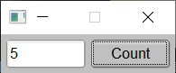
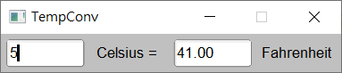
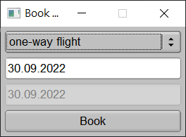
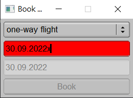
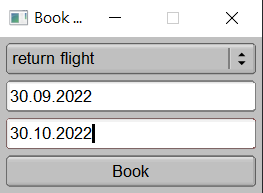
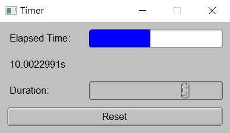
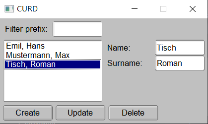
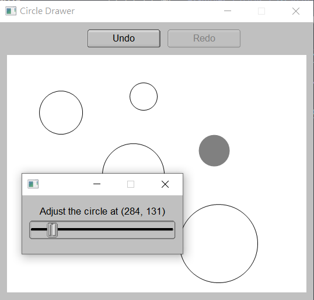
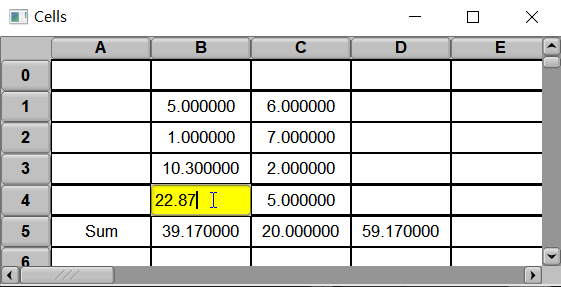

# 7GUIs examples

These are examples of implementing [7GUIs](https://eugenkiss.github.io/7guis/).

The implementation heavily references:
1. [7guis-fltk-rs](https://github.com/tdryer/7guis-fltk-rs)
2. [7GUIs Implementation in IUP](https://www.tecgraf.puc-rio.br/iup/en/7gui/7gui.html)

## Counter

## Temperature Converter

## Flight Booker

## Timer

## CRUD

## Circle Drawer

## Cells

> only implement the `SUM()` formula.

